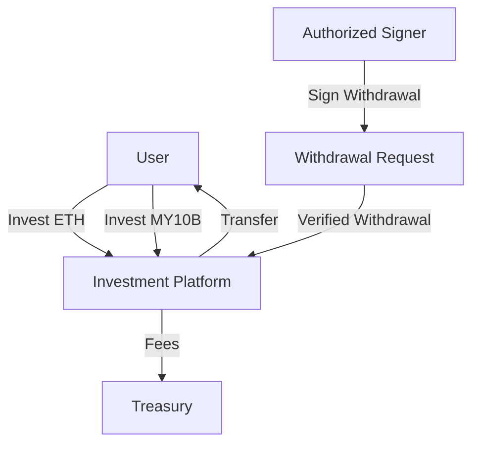

# My10Billion Platform Smart Contracts 🚀

A secure and efficient smart contract system for the My10Billion investment platform, built with modern Solidity patterns and comprehensive security features.

## Overview 📋

The My10Billion platform provides a secure way for users to invest using both ETH and the platform's native MY10B token. This repository contains the core smart contracts that power the platform's beta phase, focusing on secure investment handling and authorized withdrawals.

### Key Features 🔑

- **Dual Investment Options**: Accept both ETH and MY10B token investments
- **Secure Withdrawals**: EIP-712 signed authorizations for withdrawals
- **Role-Based Security**: Granular access control for different platform operations
- **Fee Management**: Automated fee collection and treasury management
- **Pausable Operations**: Emergency pause functionality for enhanced security
- **Gas Optimized**: Uses custom errors and modern Solidity patterns

## Smart Contracts 📄

### MY10B Token (`My10BToken.sol`)
- ERC20 token with permit functionality
- Maximum supply of 10 billion tokens
- Pausable transfers
- Role-based minting and burning
- Gas-optimized using custom errors

### Investment Platform (`My10BInvestmentPlatform.sol`)
- Secure investment handling for ETH and MY10B tokens
- EIP-712 compliant withdrawal authorization
- Role-based access control
- Treasury fee management (2.5%)
- Reentrancy protection
- Comprehensive event logging

## Security Features 🛡️

- **Access Control**: Granular role system for platform operations
- **Safe Transfers**: Uses OpenZeppelin's SafeERC20
- **Signature Verification**: EIP-712 typed signatures for withdrawals
- **Reentrancy Guards**: All state-changing operations are protected
- **Pausable**: Emergency pause functionality
- **Pull Payments**: Secure withdrawal pattern implementation
- **Custom Errors**: Gas-efficient error handling
- **Events**: Comprehensive event logging for all operations

## Development 🛠️

### Prerequisites

- [Foundry](https://book.getfoundry.sh/getting-started/installation)
- Solidity ^0.8.20

### Installation

1. Clone the repository:
```bash
git clone <repository-url>
cd my10b-platform
```

2. Install dependencies:
```bash
forge install
```

### Testing

Run the test suite:
```bash
forge test
```

### Deployment

1. Set up environment variables:
```bash
export PRIVATE_KEY=your_private_key
export TREASURY_ADDRESS=your_treasury_address
```

2. Deploy contracts:
```bash
forge script script/DeployMy10B.s.sol --rpc-url <your-rpc-url> --broadcast
```

## Usage 📝

### Investing

Users can invest using either ETH or MY10B tokens:
```solidity
// Invest with ETH
platform.investWithETH{value: amount}();

// Invest with MY10B tokens
my10bToken.approve(platformAddress, amount);
platform.investWithToken(amount);
```

### Withdrawing

Withdrawals require authorization from a designated signer:

1. Get a signed withdrawal message from an authorized signer
2. Submit the withdrawal request with the signature:
```solidity
platform.withdrawToken(amount, deadline, signature);
```

## Architecture 🏗️



## Roles and Permissions 🔐

- **DEFAULT_ADMIN_ROLE**: Platform administration and role management
- **WITHDRAWAL_SIGNER_ROLE**: Authorized to sign withdrawal requests
- **TREASURY_ROLE**: Access to treasury operations
- **MINTER_ROLE** (Token): Authorized to mint new tokens
- **BURNER_ROLE** (Token): Authorized to burn tokens
- **PAUSER_ROLE** (Token): Can pause token transfers

## Future Roadmap 🗺️

1. Advanced on-chain automation features
2. Expanded investment options
3. Automated revenue distribution
4. Enhanced governance mechanisms

## License 📜

MIT License - see LICENSE file for details
